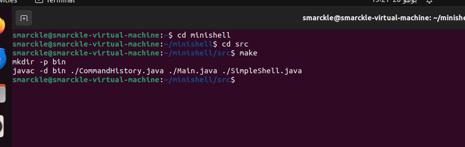
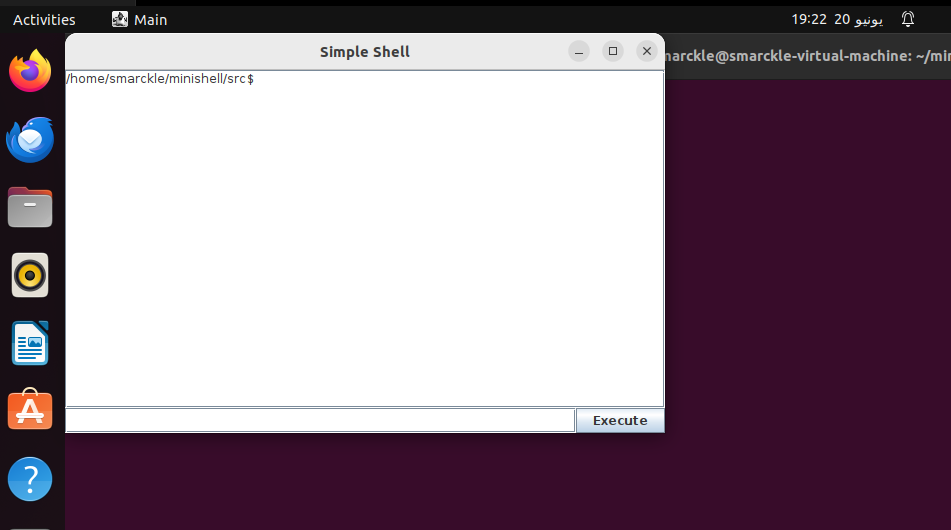
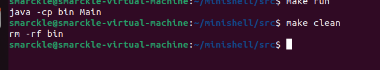

# MiniShell

This project is an implementation of the Minishell in Java. The solution aims to provide a functional command-line interpreter that allows users to execute commands and manage processes.

# List of command 

- `mkdir` : Creates a new directory with the specified name.
- `ls` : Lists files and directories.
- `touch` : Creates a new empty file or updates the timestamp of an existing file.
- `echo` : Displays a line of text or variables.
- `pwd` : Prints the current working directory.
- `cd` : Changes the current directory.
- `for` : Loops through a set of values and executes commands.
- `cat` : Displays the contents of a file.
- `grep` : Searches for a specific pattern in files.

# User Manual 

the project contains the following files:

- [Main.c](src/Main.java): The main file.
- [SimpleShell.java](src/SimpleShell.java): The file that contains all the methods of the project.
- [CommandHistory.java](src/CommandHistory.java): The file that handles the history of commands.
- [Makefile](src/Makefile): The Makefile used to compile the project.

## Table of Contents

- [Installation](#installation)
- [Execution](#Execution)

## Installation

Firstly, you will need to install java with the commands ```sudo apt update``` and ```sudo apt install default-jdk```.

Secondly, you will also need to install  **git** so you can clone the ripository, you can do it using the commands ```sudo apt update``` and ```sudo apt install git```

finally install the command ```make``` so you can use the Makefile to compile, you can use the commands ```sudo apt update```and ```sudo apt install make```

Clone the repository:

```bash
git clone https://github.com/Elfergouchyassine/minishell1.git
```

Enter the repository with the commande  ```cd src```

## Execution

When all the files are cloned from the github repository, you can use the [Makefile](src/Makefile) to compile and run the program:

To compile the program use the command ```make``` the compiler will recognize the Makefile and execute it.

```bash
make
```


To run the program use the command ```make run```.

```bash
make run
```


When you finish using the command-line interpreter, you will need to clean all the files that had been used with ```make clean``` :


> **⚠ Important:**
> The Makefile provided in this repository is designed to only work on Unix-like operating systems.